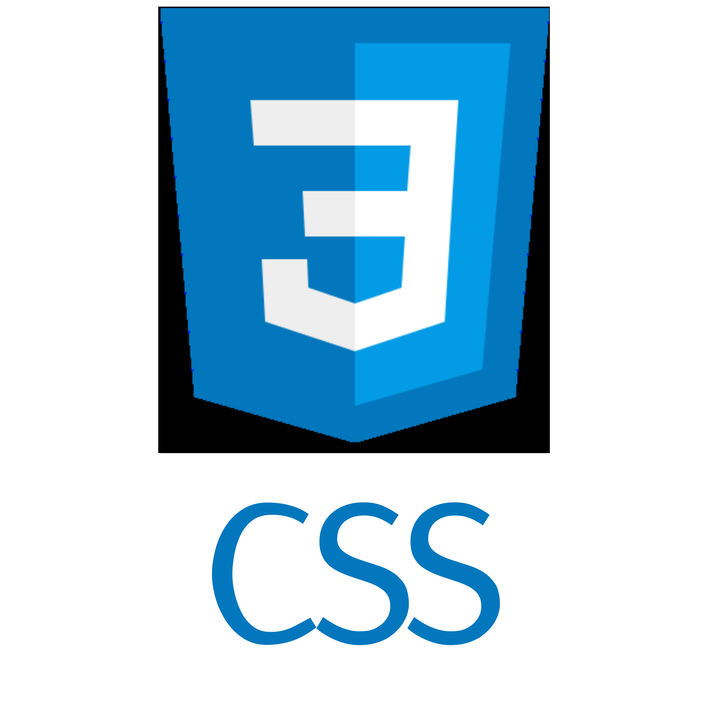
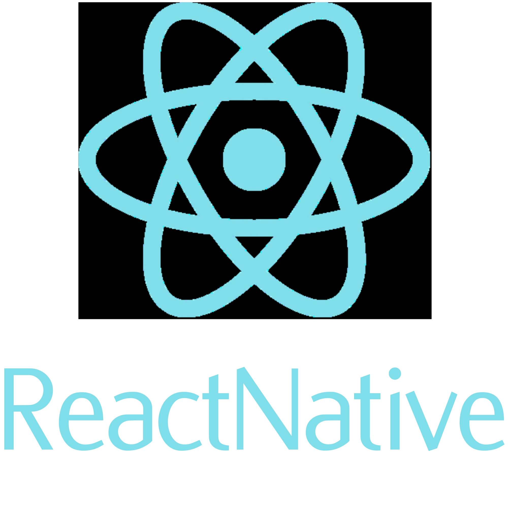
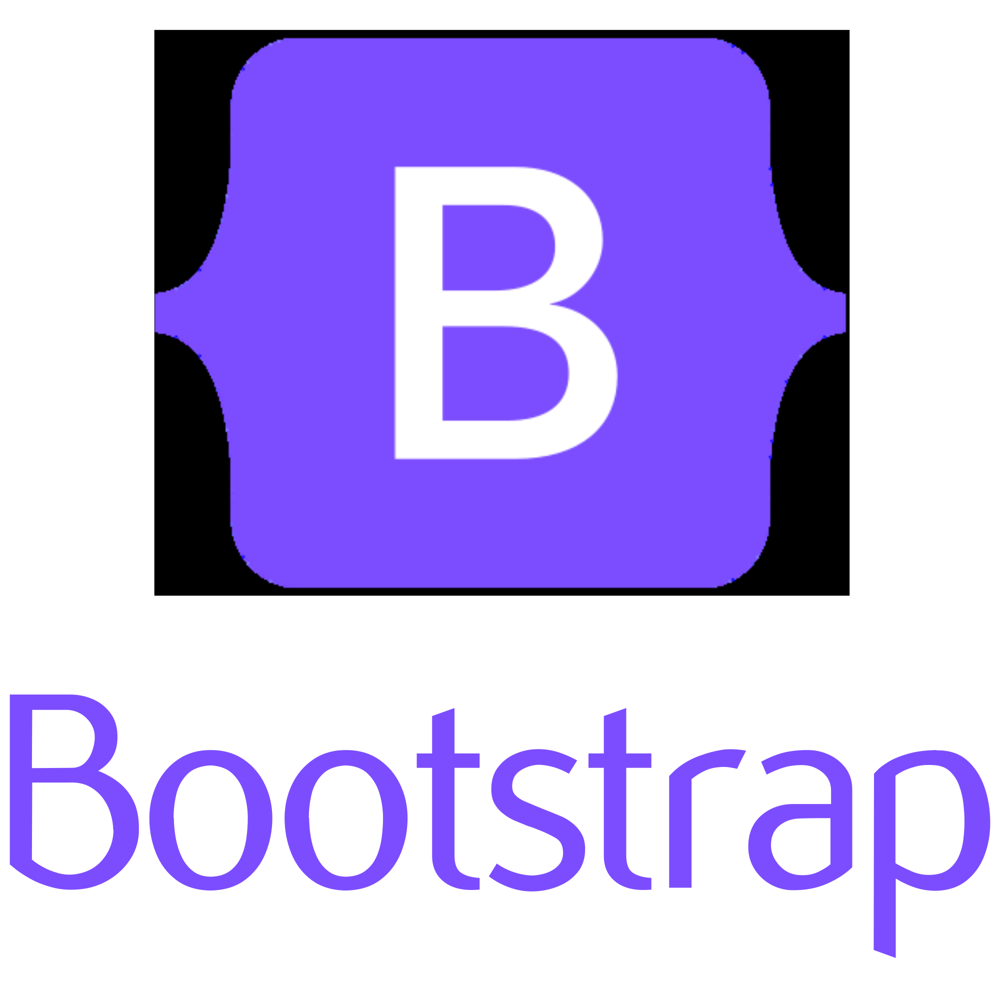

# Oii, eu me chamo Evilen Barreto!

  No momento me encontro realizando graduação, cursando Análise e Desenvolvimento de Sistemas na UniGrande. Sou Designer Gráfica durante meu tempo livre, e estou aprimorando meus conhecimentos em Arte 3D.

## Linguagens com Experiência

  &nbsp
  &nbsp
  
  

## Frameworks

  &nbsp
  

## Redes Sociais

  
  
  

  

